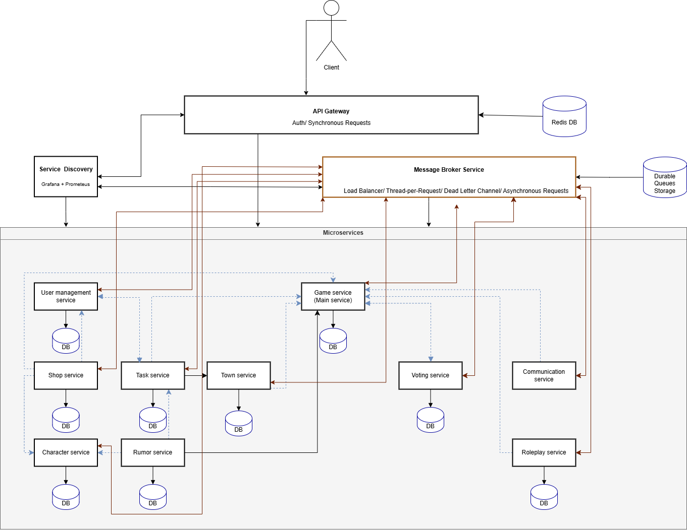

# Mafia Platform Design Document

---

This document outlines the microservice architecture, technologies, API and communication patterns for the multiplayer
game, "Mafia".

## Game Flow Overview

---

It's a social deduction game where players secretly work to find all mafias while earning money by completing tasks to
buy items for an advantage.

### Game Setup & Roles

The game begins in a lobby. Once at least 5 players have joined, the game service assigns a random career and a hidden
role to each player.

Career: A player's career (e.g., Teacher, Hunter, Banker) determines the daily tasks they can complete to earn money.

Role: A player's role (e.g., Mafia, Doctor, Investigator) dictates their secret actions during the night and determines
their specific win condition.

### The Day Phase

During the day, all players are active simultaneously. They can move to different locations in the city to complete
career-specific tasks and earn money. Money can be spent in the shop on various items/assets, which may aid in their
investigation or provide other benefits.

### The Night Phase

When the day ends, the night begins, and each player acts according to their role:

- Mafia: Secretly chooses a player to eliminate.
- Doctor: Secretly chooses a player to save from a potential attack.
- Investigator: Secretly chooses a player to reveal their role.

These and other role-based actions occur simultaneously.

### Voting and Exile

After the night, a new day begins, and the results of the night's actions are announced in the chat (e.g., "X was
murdered"). Players use the chat to discuss who they suspect of being the Mafia. Following the discussion, a vote is
cast, and the player with the most votes is exiled from the game. If there is a tie, no one is exiled.

### Victory Conditions

The game continues with a cycle of day and night phases until one of two conditions is met:

- Non-Mafia Victory: The non-Mafia players win if all Mafia members are successfully identified and exiled.
- Mafia Victory: The Mafia wins if the number of Mafia members is equal to or greater than the number of non-Mafia
  members remaining in the game.

# Service Boundaries & Architecture

---

## Service Responsibilities

- User Management Service: Handles user registration, authentication, profile data (email, username), and manages
  in-game currency balances. It also tracks device and location information for account security.
- Game Service: Acts as the central game orchestrator. It manages game lobbies, player states (role, status, career),
  controls the day/night cycle, and broadcasts major game events (e.g., deaths, announcements) to the relevant services.
- Shop Service: Manages the in-game item shop. It allows players to purchase items using their currency and includes an
  algorithm to balance item availability daily.
- Roleplay Service: Governs the logic for role-specific abilities. It validates and executes player actions (e.g., a
  Mafia member performing a kill), records these actions, and generates filtered announcements (e.g., "A player was
  attacked last night") for the Game Service to broadcast.
- Town Service: Manages the game world's locations. It tracks every player's movement between locations and reports
  these movements for other services to use.
- Character Service: Manages player avatars and inventory. Keeps track of current customized assets and items purchased
  from the Shop. Once an asset is changed it disappears from inventory, while new one is added. Items can be used (e.g.,
  garlic) or dropped.
- Rumors Service: Provides an information marketplace. Players can spend currency to buy pieces of information (rumors)
  about other players, sourced from their actions, appearance, or location.
- Communication Service: Facilitates all in-game chat. It provides a global chat during the voting phase and private,
  secure chat channels for specific groups (e.g., Mafia members, players in the same location).
- Task Service: Assigns daily tasks to players based on their role and career. It validates task completion and triggers
  currency rewards. The actions taken during tasks can become fodder for the Rumors Service.
- Voting Service: Manages the daily voting process to exile a player. It collects votes from all players, tallies the
  results, and reports the outcome to the Game Service.
- Message Broker: Is the central nervous system of the microservices architecture. It handles asynchronous event dispatching, ensures reliable delivery via durable queues, and orchestrates Distributed Transactions using the **Two-Phase Commit (2PC)** protocol.

## Architectural Diagram



This architectural diagram illustrates a mature microservices ecosystem centered around a custom-built Message Broker. The system begins with a client interacting through an API Gateway, which has been streamlined to handle only user authentication and caching. All service-to-service communication is routed through the Message Broker, which now carries advanced responsibilities such as load balancing, circuit breaking, thread-per-request handling, and durable message delivery.

The Message Broker acts as the backbone of asynchronous communication, interfacing with Redis and domain storage, and supporting both subscriber-based queues for Gateway-to-Service interactions and topic-based queues for inter-service events. Each microservice—ranging from user management to voting and communication—registers its topic interests with the Service Discovery module, enabling dynamic routing and decoupled event handling. The Game Service stands out as a central node, coordinating interactions across the system.

# Technologies & Communication Patterns

---

## Technology Stack

| Service(s)            | Developer      | Language | Framework    | Database          |
|-----------------------|----------------|----------|--------------|-------------------|
| User Management, Game | Alexandrina G. | Python   | FastAPI      | PostgreSQL        |
| Shop, Roleplay        | Alexander C.   | C#       | ASP.NET Core | PostgreSQL        |
| Town, Character       | Dmitrii C.     | Kotlin   | Spring Boot  | PostgreSQL, Redis |
| Rumors, Communication | Dmitrii B.     | C#       | ASP.NET Core | PostgreSQL        |
| Task, Voting          | Irina N.       | Python   | FastAPI      | PostgreSQL        |

## Communication Patterns

- Synchronous (REST APIs)

  Description: For direct, request/response interactions where the client needs an immediate answer. For example, when a
  user attempts to log in, they must wait for a success or failure response.
  Technology: We use RESTful APIs over HTTPS with JSON as the data serialization format.

  ### Motivation & Trade-offs:
- ✅ Simplicity: REST is a well-understood, stateless, and straightforward pattern, making development and debugging
  easier.
- ✅ Immediate Feedback: It's perfect for user-facing actions that require instant confirmation.
- ❌ Tight Coupling: The caller is temporarily coupled to the called service. If the downstream service is slow or
  unavailable, the caller is blocked.

# Communication Contract

This section defines our data management strategy and the specific API endpoints for each service.

## Data Management

- Database per Service: Each microservice (except communication service) owns and manages its own private database. No
  other service is allowed to access this database directly.
- API-based Access: All communication and data sharing between services must occur through the publicly exposed and
  well-defined APIs or through the asynchronous messaging system.

# API Endpoints

---

All request and response bodies are in **JSON** format.

## 1. User Management Service

___

### Dockerhub image: 'alexandrina581/user-management-service'

___

### Requires Environment Configuration

Create your `.env` file based on the template:

```bash
cp .env.template .env
```

Then edit the `.env` file with your configuration:

```env
USER_MANAGEMENT_SERVICE_POSTGRES_USER=postgres
USER_MANAGEMENT_SERVICE_POSTGRES_PASSWORD=your_password_here
USER_MANAGEMENT_SERVICE_POSTGRES_DB=user_management_service
USER_MANAGEMENT_SERVICE_POSTGRES_HOST=db
USER_MANAGEMENT_SERVICE_POSTGRES_PORT=5432

SECRET_KEY=your_secret_key_here
ALGORITHM=HS256
```

---

#### POST /register

Creates a new user account.

**Request Body:**

```json
{
  "username": "string",
  "email": "string",
  "password": "string",
  "identification": "string",
  "deviceInfo": "object",
  "location": "string"
}
```

**Success Response (201):**

```json
{
  "data": {
    "id": 1,
    "username": "string"
  }
}
```

**Error Responses:**

- **409 Conflict**
  ```json
  {
    "error": {
      "code": "USER_ALREADY_EXISTS",
      "message": "Username or email already exists"
    }
  }
  ```
- **400 Bad Request**
  ```json
  {
    "error": {
      "code": "VALIDATION_ERROR",
      "message": "Password must be at least 8 characters long"
    }
  }
  ```

#### POST /login

Authenticates user and returns JWT token.

**Request Body:**

```json
{
  "username": "string",
  "password": "string",
  "deviceInfo": "object"
}
```

**Success Response (200):**

```json
{
  "data": {
    "token": "eyJhbGciOiJIUzI1NiIsInR5cCI6IkpXVCJ9...",
    "username": "string"
  }
}
```

**Error Responses:**

- **401 Unauthorized**
  ```json
  {
    "error": {
      "code": "INVALID_CREDENTIALS",
      "message": "Invalid username or password"
    }
  }
  ```

#### GET /profile/{id}

Retrieves user profile information.

**Headers:**

- `Authorization: Bearer <token>`

**Success Response (200):**

```json
{
  "data": {
    "id": 1,
    "username": "string",
    "email": "string",
    "currency": {
      "diamonds": 50,
      "coins": 250
    }
  }
}
```

**Error Responses:**

- **401 Unauthorized**
  ```json
  {
    "error": {
      "code": "INVALID_TOKEN",
      "message": "Invalid or expired token"
    }
  }
  ```
- **403 Forbidden**
  ```json
  {
    "error": {
      "code": "FORBIDDEN",
      "message": "Not authorized to access this profile"
    }
  }
  ```
- **404 Not Found**
  ```json
  {
    "error": {
      "code": "USER_NOT_FOUND",
      "message": "User not found"
    }
  }
  ```

#### PUT /currency/{id}

Adds, subtracts or sets a user's currency balance.

**Headers:**

- `Authorization: Bearer <token>`

**Request Body:**

```json
{
  "currency": "diamonds",
  "amount": 1,
  "operation": "add"
}
```

**Success Response (200):**

```json
{
  "data": {
    "id": 1,
    "newBalance": 11,
    "transactionId": 1,
    "currency": "diamonds"
  }
}
```

**Error Responses:**

- **400 Bad Request**
  ```json
  {
    "error": {
      "code": "INSUFFICIENT_FUNDS",
      "message": "You do not have enough {currency_type} balance"
    }
  }
  ```
  ```json
  {
    "error": {
      "code": "INVALID_AMOUNT",
      "message": "Balance cannot be set to a negative value"
    }
  }
  ```
- **401 Unauthorized**
  ```json
  {
    "error": {
      "code": "INVALID_TOKEN",
      "message": "Invalid or expired token"
    }
  }
  ```
- **403 Forbidden**
  ```json
  {
    "error": {
      "code": "FORBIDDEN",
      "message": "Not authorized to update this user's currency"
    }
  }
  ```
- **404 Not Found**
  ```json
  {
    "error": {
      "code": "USER_NOT_FOUND",
      "message": "User not found"
    }
  }
  ```

---

## 2. Game Service

___

### Dockerhub image: 'alexandrina581/game-service'

___

### Requires Environment Configuration
Create your `.env` file based on the template:
```bash
cp .env.template .env
```

Then edit the `.env` file with your configuration:
```env
GAME_SERVICE_POSTGRES_USER=postgres
GAME_SERVICE_POSTGRES_PASSWORD=your_password_here
GAME_SERVICE_POSTGRES_DB=game_service
GAME_SERVICE_POSTGRES_HOST=game-service-db
GAME_SERVICE_POSTGRES_PORT=5432
```

---

#### POST /lobby

Creates a new game lobby.

**Headers:**

- `Authorization: Bearer <token>`

**Request Body:**

```json
{
  "hostId": 1,
  "lobbyName": "string",
  "maxPlayers": 1
}
```

**Success Response (201):**

```json
{
  "data": {
    "gameId": 1,
    "lobbyId": 1,
    "hostId": 1,
    "status": "waiting_for_players",
    "joinCode": 1
  }
}
```

**Error Responses:**

- **400 Bad Request**
  ```json
  {
    "error": {
      "code": "INVALID_PLAYER_COUNT",
      "message": "Max players must be between 5 and 30"
    }
  }
  ```

#### POST /lobby/{lobbyId}/join

Join an existing game lobby.

**Headers:**

- `Authorization: Bearer <token>`

**Request Body:**

```json
{
  "id": 1
}
```

**Success Response (200):**

```json
{
  "data": {
    "lobbyId": 1,
    "currentPlayers": 2,
    "maxPlayers": 5
  }
}
```

**Error Responses:**

- **404 Not Found**
  ```json
  {
    "error": {
      "code": "LOBBY_NOT_FOUND",
      "message": "Lobby does not exist"
    }
  }
  ```
- **409 Conflict**
  ```json
  {
    "error": {
      "code": "LOBBY_FULL",
      "message": "Lobby has reached maximum capacity"
    }
  }
  ```

#### POST /lobby/{lobbyId}/start

Start the game in the lobby.

**Headers:**

- `Authorization: Bearer <token>`

**Request Body:**

```json
{
  "hostId": 1
}
```

**Success Response (200):**

```json
{
  "data": {
    "gameId": 1,
    "status": "started",
    "players": "array"
  }
}
```

**Error Responses:**

- **403 Forbidden**
  ```json
  {
    "error": {
      "code": "NOT_HOST",
      "message": "Only the host can start the game"
    }
  }
  ```
- **400 Bad Request**
  ```json
  {
    "error": {
      "code": "INSUFFICIENT_PLAYERS",
      "message": "At least 5 players required to start the game"
    }
  }
  ```

#### GET /game/{gameId}/state

Get current game state.

**Headers:**

- `Authorization: Bearer <token>`

**Success Response (200):**

```json
{
  "data": {
    "gameId": 1,
    "phase": "day|night|voting|ended",
    "dayNumber": "number",
    "playersAlive": "array",
    "totalPlayers": 10
  }
}
```

**Error Responses:**

- **404 Not Found**
  ```json
  {
    "error": {
      "code": "GAME_NOT_FOUND",
      "message": "Game does not exist"
    }
  }
  ```
  
**Error Responses:**
- **403 Forbidden**
  ```json
  {
    "error": {
    "code": "ACCESS_DENIED",
    "message": "You are not a player in this game"
    }
  }
  ```

#### GET /game/{gameId}/players/status

Get status of each player (alive/not alive).

**Headers:**

- `Authorization: Bearer <token>`

**Success Response (200):**

```json
{
  "data": {
    "players": [
      {
        "playerId": 1,
        "username": "string",
        "status": "alive"
      },
      {
        "playerId": 2,
        "username": "string",
        "status": "eliminated"
      }
    ]
  }
}
```

#### PUT /game/{gameId}/players/{playerId}/status
Update player status (used by Roleplay Service when players are killed/affected).

**Headers:**

- `Authorization: Bearer <token>`

**Request Body:**

```json
{
  "status": "eliminated|alive|protected",
  "cause": "killed_by_mafia|voted_out|protected_by_doctor",
  "dayNumber": 2
}
```

**Success Response (200):**

```json
{
  "data": {
    "id": 1,
    "previousStatus": "alive",
    "newStatus": "eliminated",
    "cause": "killed_by_mafia",
    "dayNumber": 2
  }
}
```

**Error Responses:**
- **404 Not Found**
  ```json
  {
    "error": {
      "code": "GAME_NOT_FOUND",
      "message": "Game does not exist"
    }
  }
  ```
- **404 Not Found**
  ```json
  {
    "error": {
      "code": "PLAYER_NOT_FOUND",
      "message": "Player does not exist in this game"
    }
  }
  ```
- **400 Bad Request**
  ```json
  {
    "error": {
      "code": "INVALID_STATUS_TRANSITION",
      "message": "Cannot change status from eliminated to alive"
    }
  }
  ```
- **409 Conflict**
  ```json
  {
    "error": {
      "code": "PLAYER_ALREADY_ELIMINATED",
      "message": "Player is already eliminated"
    }
  }
  ```


#### GET /game/{gameId}/events

Get game events.

**Headers:**

- `Authorization: Bearer <token>`

**Success Response (200):**

```json
{
  "data": {
    "events": [
      {
        "id": 1,
        "type": "elimination",
        "message": "Player X was eliminated"
      }
    ]
  }
}
```

#### GET /game/{gameId}/players-roles
Get players and their roles and careers.

**Headers:**

- `Authorization: Bearer <token>`

**Success Response (200):**

```json
{
  "data": {
    "players": [
      {
        "playerId": 1,
        "username": "Alice",
        "role": "mafia",
        "career": "banker"
      }
    ]
  }
}
```

#### POST /game/{gameId}/voting

Submit voting results.

**Headers:**

- `Authorization: Bearer <token>`

**Request Body:**

```json
{
  "targetPlayerId": 5
}
```

**Success Response (200):**

```json
{
  "data": {
    "voteSubmitted": true,
    "targetPlayerId": 5
  }
}
```

**Error Responses:**

- **400 Bad Request**
  ```json
  {
    "error": {
      "code": "VOTING_NOT_ACTIVE",
      "message": "Voting phase is not currently active"
    }
  }
  ```
- **404 Not Found**
  ```json
  {
    "error": {
      "code": "PLAYER_NOT_FOUND",
      "message": "Target player does not exist"
    }
  }
  ```
- **409 Conflict**
  ```json
  {
    "error": {
      "code": "ALREADY_VOTED",
      "message": "You have already cast your vote"
    }
  }
  ```

#### POST /game/{gameId}/voting/elimination
Receive voted-out player to Game Service.

**Headers:**
- `Authorization: Bearer <token>`

**Request Body:**
```json
{
  "gameId": 1,
  "dayNumber": 2,
  "votedOutPlayerId": 13
}
```

**Success Response (200):**
```json
{
  "data": {
    "gameId": 1,
    "dayNumber": 2,
    "votedOutPlayerId": 13
  }
}
```

**Error Responses:**
- **404 Not Found**
  ```json
  {
    "error": {
      "code": "GAME_NOT_FOUND",
      "message": "Game does not exist"
    }
  }
  ```
  
- **409 Conflict**
  ```json
  {
    "error": {
      "code": "ALREADY_NOTIFIED",
      "message": "Elimination has already been sent for this day"
    }
  }
  ```

---


### WebSocket Events

The Game Service broadcasts real-time events to all connected players using WebSocket connections.

#### WS /lobby/{lobbyId}/events
Real-time lobby events before game starts.


**Authentication:** JWT token required via query parameter

**Events Broadcasted:**

**Player Joined Lobby:**
```json
{
  "type": "player_joined_lobby",
  "data": {
    "lobbyId": 1,
    "id": 1,
    "username": "string",
    "currentPlayers": 4,
    "maxPlayers": 10
  }
}
```

**Player Left Lobby:**
```json
{
  "type": "player_left_lobby",
  "data": {
    "lobbyId": 1,
    "id": 1,
    "username": "string",
    "currentPlayers": 3
  }
}
```

**Game Starting:**
```json
{
  "type": "game_starting",
  "data": {
    "lobbyId": 1,
    "gameId": 1,
    "countdown": 5,
    "message": "Game starting in 5 seconds..."
  }
}
```

**Error Responses:**
- **4001 - Invalid Token**
  ```json
  {
    "error": {
      "code": "INVALID_TOKEN",
      "message": "JWT token is invalid or expired"
    }
  }
  ```
- **4003 - Access Denied**
  ```json
  {
    "error": {
      "code": "ACCESS_DENIED",
      "message": "Player is not part of this lobby"
    }
  }
  ```
- **4004 - Lobby Not Found**
  ```json
  {
    "error": {
      "code": "LOBBY_NOT_FOUND",
      "message": "Lobby does not exist"
    }
  }
  ```
- **4009 - Connection Limit Exceeded**
  ```json
  {
    "error": {
      "code": "CONNECTION_LIMIT_EXCEEDED",
      "message": "Too many connections from this player"
    }
  }
  ```


#### WS /game/{gameId}/events
Real-time game events during active gameplay.


**Authentication:** JWT token required via query parameter

**Events Broadcasted:**

**Phase Change:**
```json
{
  "type": "phase_change",
  "data": {
    "gameId": 1,
    "newPhase": "night|day|voting",
    "dayNumber": 2,
    "duration": 300,
    "message": "Night phase has begun."
  }
}
```


**New Day Started:**
```json
{
  "type": "new_day",
  "data": {
    "gameId": 1,
    "dayNumber": 2,
    "phase": "day",
    "message": "Day 2 has begun."
  }
}
```

**Player Elimination:**
```json
{
  "type": "player_elimination",
  "data": {
    "gameId": 1,
    "id": 2,
    "cause": "voted_out|killed_by_mafia",
    "dayNumber": 2,
    "remainingPlayers": 7
  }
}
```

**Game Announcement:**
```json
{
  "type": "game_announcement",
  "data": {
    "gameId": 1,
    "message": "A player was attacked last night but survived!",
    "category": "night_result|system|voting"
  }
}
```

**Role and Career Assignment:**
```json
{
  "type": "role_assignment",
  "data": {
    "gameId": 1,
    "id": 2,
    "role": "mafia|doctor|investigator|villager",
    "career": "teacher|hunter|banker|other"
  }
}
```

**Voting Phase Started:**
```json
{
  "type": "voting_started",
  "data": {
    "gameId": 1,
    "dayNumber": 2
  }
}
```

**Game Ended:**
```json
{
  "type": "game_ended",
  "data": {
    "gameId": 1,
    "winner": "mafia|villagers",
    "winCondition": "mafia_majority|all_mafia_eliminated",
    "survivingPlayers": [
      {
        "id": 1,
        "username": "string",
        "role": "mafia"
      }
    ],
    "totalDays": 3
  }
}
```

**Connection Established:**
```json
{
  "type": "connection_established",
  "data": {
    "gameId": 1,
    "id": 2,
    "message": "Successfully connected to game events"
  }
}
```

**Error Responses:**
- **4001 - Invalid Token**
  ```json
  {
    "error": {
      "code": "INVALID_TOKEN",
      "message": "JWT token is invalid or expired"
    }
  }
  ```
- **4003 - Access Denied**
  ```json
  {
    "error": {
      "code": "ACCESS_DENIED",
      "message": "Player is not part of this game"
    }
  }
  ```
- **4004 - Game Not Found**
  ```json
  {
    "error": {
      "code": "GAME_NOT_FOUND",
      "message": "Game does not exist"
    }
  }
  ```
- **4010 - Game Not Started**
  ```json
  {
    "error": {
      "code": "GAME_NOT_STARTED",
      "message": "Cannot connect to events before game has started"
    }
  }
  ```
- **4011 - Player Eliminated**
  ```json
  {
    "error": {
      "code": "PLAYER_ELIMINATED",
      "message": "Eliminated players cannot receive game events"
    }
  }
  ```

___

## 3. Shop Service

#### POST /purchase

Purchase an item from the shop.

**Headers:**

- `Authorization: Bearer <token>`

**Request Body:**

```json
{
  "itemId": 1,
  "quantity": 1
}
```

**Success Response (200):**

```json
{
  "data": {
    "itemId": 1,
    "itemName": "string",
    "quantity": 1,
    "totalCost": 150,
    "remainingCurrency": {
      "coins": 100,
      "diamonds": 50
    }
  }
}
```

**Error Responses:**

- **400 Bad Request**
  ```json
  {
    "error": {
      "code": "INSUFFICIENT_FUNDS",
      "message": "Not enough money to purchase this item"
    }
  }
  ```
- **404 Not Found**
  ```json
  {
    "error": {
      "code": "ITEM_NOT_FOUND",
      "message": "Item does not exist"
    }
  }
  ```
- **409 Conflict**
  ```json
  {
    "error": {
      "code": "ITEM_OUT_OF_STOCK",
      "message": "Item is currently out of stock"
    }
  }
  ```

#### POST /phase-update

Receive day/night update and automatically restock.

**Headers:**

- `Authorization: Bearer <token>`

**Request Body:**

```json
{
  "gameId": 1,
  "phase": "night",
  "dayNumber": 2
}
```

**Success Response (200):**

```json
{
  "data": {
    "restocked": true,
    "newItems": 5,
    "phase": "night"
  }
}
```

#### GET /items

List available items in the shop.

**Headers:**

- `Authorization: Bearer <token>`

**Success Response (200):**

```json
{
  "data": {
    "items": [
      {
        "id": 1,
        "name": "Night Vision Goggles",
        "description": "See better during night phase",
        "price": {
          "coins": 150,
          "diamonds": 0
        },
        "stock": 5
      }
    ]
  }
}
```

---

## 4. Roleplay Service

#### POST /phase-update

Update day/night phase.

**Headers:**

- `Authorization: Bearer <token>`

**Request Body:**

```json
{
  "gameId": 1,
  "newPhase": "night",
  "dayNumber": 2
}
```

**Success Response (200):**

```json
{
  "data": {
    "gameId": 1,
    "phase": "night",
    "dayNumber": 2
  }
}
```

**Error Responses:**

- **400 Bad Request**
  ```json
  {
    "error": {
      "code": "INVALID_PHASE_TRANSITION",
      "message": "Cannot transition from current phase to requested phase"
    }
  }
  ```

#### POST /night-events

Register night events - which contains who did what and to whom.

**Headers:**

- `Authorization: Bearer <token>`

**Request Body:**

```json
{
  "gameId": 1,
  "playerId": 12,
  "action": "eliminate",
  "targetPlayerId": 13
}
```

**Success Response (201):**

```json
{
  "data": {
    "eventId": 1,
    "action": "eliminate"
  }
}
```

**Error Responses:**

- **400 Bad Request**
  ```json
  {
    "error": {
      "code": "INVALID_ACTION",
      "message": "This action is not valid for your role"
    }
  }
  ```
- **409 Conflict**
  ```json
  {
    "error": {
      "code": "ACTION_ALREADY_SUBMITTED",
      "message": "You have already submitted an action for this night"
    }
  }
  ```

---

## 5. Town Service

### Dockerhub image: 'dimaubuntu/town-service'

#### GET /locations

Retrieve all available locations.

**Headers:**

- `Authorization: Bearer <token>`

**Success Response (200):**

```json
{
  "data": {
    "locations": [
      {
        "id": 1,
        "name": "School",
        "description": "Education center"
      }
    ]
  }
}
```

#### GET /locations/{locationId}

Get details of a specific location.

**Headers:**

- `Authorization: Bearer <token>`

**Success Response (200):**

```json
{
  "data": {
    "id": 1,
    "name": "School",
    "description": "Education center"
  }
}
```

**Error Responses:**

- **404 Not Found**
  ```json
  {
    "error": {
      "code": "LOCATION_NOT_FOUND",
      "message": "Location does not exist"
    }
  }
  ```

#### GET /movements/{lobbyId}

Get movement of all players.

**Headers:**

- `Authorization: Bearer <token>`

**Success Response (200):**

```json
{
  "data": {
    "movements": [
      {
        "playerId": 1,
        "locationId": 1,
        "timestamp": "2023-10-01T12:00:00Z"
      }
    ]
  }
}
```

#### POST /move

Movement depending on location and day.

**Headers:**

- `Authorization: Bearer <token>`

**Request Body:**

```json
{
  "lobbyId": 1,
  "playerId": 1,
  "locationId": 1
}
```

**Success Response (200):**

```json
{
  "data": {
    "playerId": 1,
    "fromLocationId": 1,
    "toLocationId": 1,
    "timestamp": "2023-10-01T12:00:00Z"
  }
}
```

**Error Responses:**

- **404 Not Found**
  ```json
  {
    "error": {
      "code": "LOCATION_NOT_FOUND",
      "message": "Location does not exist"
    }
  }
  ```

#### GET /movements/{lobbyId}/{playerId}

Get all movements of a specific player.

**Headers:**

- `Authorization: Bearer <token>`

**Success Response (200):**

```json
{
  "data": {
    "playerId": 1,
    "movements": [
      {
        "locationId": 1,
        "locationName": "School",
        "timestamp": "2023-10-01T12:00:00Z"
      }
    ]
  }
}
```

---

## 6. Character Service

### Dockerhub image: 'dimaubuntu/character-service'

#### GET /assets/slots

Get list of all available asset slots.

**Headers:**

- `Authorization: Bearer <token>`

**Success Response (200):**

```json
{
  "data": {
    "slots": [
      "HAIR",
      "SHIRT",
      "PANTS",
      "SHOES",
      "ACCESSORY"
    ]
  }
}
```

#### GET /{playerId}/items

Get list of items for a player.

**Headers:**

- `Authorization: Bearer <token>`

**Success Response (200):**

```json
{
  "data": {
    "items": [
      {
        "id": 1,
        "quantity": 1
      }
    ]
  }
}
```

#### POST /{playerId}/items

Add item to player's inventory.

**Headers:**

- `Authorization: Bearer <token>`

**Request Body:**

```json
{
  "itemId": 1,
  "quantity": 1
}
```

**Success Response (201):**

```json
{
  "data": {
    "itemId": 1,
    "totalQuantity": 2
  }
}
```

**Error Responses:**

- **404 Not Found**
  ```json
  {
    "error": {
      "code": "ITEM_NOT_FOUND",
      "message": "Item does not exist"
    }
  }
  ```

#### DELETE /{playerId}/items/{itemId}

Drop/delete item from inventory.

**Headers:**

- `Authorization: Bearer <token>`

**Success Response (200):**

```json
{
  "data": {
    "itemId": 1,
    "removed": true
  }
}
```

**Error Responses:**

- **404 Not Found**
  ```json
  {
    "error": {
      "code": "ITEM_NOT_FOUND",
      "message": "Item not found in inventory"
    }
  }
  ```

#### POST /{playerId}/items/{itemId}/use

Use an item.

**Headers:**

- `Authorization: Bearer <token>`

**Success Response (200):**

```json
{
  "data": {
    "itemId": 1
  }
}
```

**Error Responses:**

- **404 Not Found**
  ```json
  {
    "error": {
      "code": "ITEM_NOT_FOUND",
      "message": "Item not found in inventory"
    }
  }
  ```

#### POST /{playerId}/assets

Add character asset.

**Headers:**

- `Authorization: Bearer <token>`

**Request Body:**

```json
{
  "slot": "hair",
  "assetId": 1
}
```

**Success Response (201):**

```json
{
  "data": {
    "slot": "hair",
    "assetId": 1,
    "equipped": true
  }
}
```

**Error Responses:**

- **400 Bad Request**
  ```json
  {
    "error": {
        "code": "BAD_REQUEST",
        "message": "Invalid slot type. Valid types are: HAIR, SHIRT, PANTS, SHOES, ACCESSORY"
    }

  }
  ```

#### GET /{playerId}/appearance
Get character appearance - list of all assets.

**Headers:**
- `Authorization: Bearer <token>`

**Success Response (200):**
```json
{
  "data": {
    "assets": {
      "hair": 1,
      "shirt": 1,
      "pants": 1,
      "accessories": [
        1,
        2
      ]
    }
  }
}
```

#### PUT /{playerId}/assets

Update character asset.

**Headers:**

- `Authorization: Bearer <token>`

**Request Body:**

```json
{
  "slot": "shirt",
  "assetId": 1
}
```

**Success Response (200):**

```json
{
  "data": {
    "slot": "shirt",
    "previousAssetId": 1,
    "newAssetId": 1
  }
}
```

**Error Responses:**

- **400 Bad Request**
  ```json
  {
    "error": {
        "code": "BAD_REQUEST",
        "message": "Invalid slot type. Valid types are: HAIR, SHIRT, PANTS, SHOES, ACCESSORY"
    }

  }
  ```

---

## 7. Rumours Service

**Docker Hub Repository:** `m1rrerror/mafia-rumours-service`

### Buy a rumour

**Endpoint:** `POST /api/rumours/{lobbyId}/purchase`

**Description:** Buys a rumour in the specified lobby.

**Request Body:**
```json
{
  "gameId": 1,
  "rumourType": "activity",
  "senderId": 0,
  "targetId": 1
}
```

**Available rumour types:** activity, appearance.

**Success Response (200):**
```json
{
  "data": {
    "id": 1,
    "lobbyId": "test",
    "type": "activity",
    "ownerId": 0,
    "targetId": 1,
    "text": "Player X was seen near the victim's house last night",
    "createdAt": "2025-10-01T12:00:00Z"
  }
}
```

**Error Responses:**

**400 Bad Request**
  ```json
  {
    "error": {
      "code": "INSUFFICIENT_FUNDS",
      "message": "Not enough currency to purchase rumour"
    }
  }
  ```

**404 Not Found**
  ```json
  {
    "error": {
      "code": "BAD_RUMOURS_TYPE",
      "message": "Rumours type not found"
    }
  }
  ```


---

### Get user's purchased rumours

**Endpoint:** `GET /api/rumours/{lobbyId}/user/{userId}`

**Description:** Gets all purchased rumours for the specified user in the specified lobby.

**Success Response (200):**
```json
{
  "data": [
    {
      "id": 1,
      "lobbyId": "test",
      "type": "activity",
      "ownerId": 0,
      "targetId": 1,
      "text": "Player X was seen near the victim's house last night",
      "createdAt": "2025-10-01T12:00:00Z"
    },
    {
      "id": 2,
      "lobbyId": "test",
      "type": "activity",
      "ownerId": 0,
      "targetId": 2,
      "text": "Player Y has been acting suspiciously",
      "createdAt": "2025-10-01T12:00:00Z"
    }
  ]
}

```


---

## General Errors

**503 Service Unavailable**

```json
{
  "error": {
    "code": "SERVICE_UNAVAILABLE",
    "message": "Gateway service is unavailable: message"
  }
}
```

**503 Service Unavailable**

```json
{
  "error": {
    "code": "CONCURRENCY_LIMIT_REACHED",
    "message": "The service is temporarily overloaded. Please try again later."
  }
}
```

**408 Request Timeout**

```json
{
  "error": {
    "code": "REQUEST_TIMEOUT",
    "message": "The request took too long to process."
  }
}
```

---

## 8. Communication Service

**Docker Hub Repository:** `m1rrerror/mafia-communication-service`

### Get Lobby

**Endpoint:** `GET /api/chat/lobby/{lobbyId}`

**Description:** Retrieves the specified lobby.

**Success Response (200):**

```json
{
  "data": {
    "id": "test",
    "privateChannels": {
      "detectives": {
        "name": "detectives",
        "members": {
          "2": true,
          "3": true
        }
      },
      "mafia": {
        "name": "mafia",
        "members": {
          "0": true,
          "1": true
        }
      }
    }
  }
}
```

**Error Responses:**

**404 Not Found**

```json
{
  "error": {
    "code": "LOBBY_NOT_FOUND",
    "message": "Lobby does not exist"
  }
}
```


---

### Create Lobby

**Endpoint:** `POST /api/chat/lobby/create`

**Description:** Retrieves the specified lobby.

**Request Body:**

```json
{
    "lobbyId": "test",
    "privateChannels": [
        {
            "channelName": "mafia",
            "memberIds": [0, 1]
        },
        {
            "channelName": "detectives",
            "memberIds": [2, 3]
        }
    ]
}
```

**Success Response (200):**

```json
{
  "data": {
    "id": "test",
    "privateChannels": {
      "detectives": {
        "name": "detectives",
        "members": {
          "2": true,
          "3": true
        }
      },
      "mafia": {
        "name": "mafia",
        "members": {
          "0": true,
          "1": true
        }
      }
    }
  }
}
```

**Error Responses:**

**400 Bad Request**

```json
{
  "error": {
    "code": "LOBBY_EXISTS",
    "message": "Lobby already exists"
  }
}
```


---

### Delete Lobby

**Endpoint:** `DELETE /api/chat/lobby/{lobbyId}`

**Description:** Deletes the specified lobby.

**Success Response (200):**

```json
{
  "data": {
    "message": "Lobby deleted successfully"
  }
}
```

**Error Responses:**

**404 Not Found**

```json
{
  "error": {
    "code": "LOBBY_NOT_FOUND",
    "message": "Lobby does not exist"
  }
}
```


---

### Send Global Message

**Endpoint:** `POST /api/chat/global/{lobbyId}/send-message`

**Description:** Sends a message to the specified global chat in the specified lobby.

**URL Parameters:**

* `lobbyId` *(string)* – Unique lobby identifier.

**Request Body:** [ChatMessage Model](#chatmessage-model)

**Success Response (200):**
```json
{
  "data": {
    "lobbyId": "test",
    "senderId": 0,
    "senderName": "mirrerror",
    "content": "test message",
    "timestamp": "2025-10-04T18:27:46.9786613Z"
  }
}
```

**Error Responses:**

**400 Bad Request - Validation Error**
```json
{
  "error": {
    "code": "VALIDATION_ERROR",
    "message": "Content must not exceed 200 characters"
  }
}
```

**400 Bad Request - Chat Disabled**
```json
{
  "error": {
    "code": "CHAT_DISABLED",
    "message": "Global chat is currently disabled for this lobby"
  }
}
```

**404 Not Found**
```json
{
  "error": {
    "code": "LOBBY_NOT_FOUND",
    "message": "Lobby does not exist"
  }
}
```

---

### Send Private Message

**Endpoint:** `POST /api/chat/private/{lobbyId}/{channelName}/send-message`

**Description:** Sends a message to all clients in the specified private channel inside the specified lobby.

**URL Parameters:**

* `lobbyId` *(string)* – The lobby identifier.
* `channelName` *(string)* – The private channel name.

**Request Body:** [ChatMessage Model](#chatmessage-model)

**Success Response (200):**
```json
{
  "data": {
    "channelName": "detectives",
    "lobbyId": "test",
    "senderId": 2,
    "senderName": "mirrerror",
    "content": "test message",
    "timestamp": "2025-10-04T18:28:28.3525069Z"
  }
}
```

**Error Responses:**

**400 Bad Request - Validation Error**
```json
{
  "error": {
    "code": "VALIDATION_ERROR",
    "message": "Sender name must be between 2 and 50 characters"
  }
}
```

**403 Forbidden**
```json
{
  "error": {
    "code": "ACCESS_DENIED",
    "message": "You do not have access to this private channel"
  }
}
```

**404 Not Found - Lobby**
```json
{
  "error": {
    "code": "LOBBY_NOT_FOUND",
    "message": "Lobby does not exist"
  }
}
```

**404 Not Found - Channel**
```json
{
  "error": {
    "code": "CHANNEL_NOT_FOUND",
    "message": "Private channel does not exist"
  }
}
```

---

### Toggle Global Chat

**Endpoint:** `POST /api/chat/global/{lobbyId}/toggle`

**Description:** Enables/disables (toggles) the global chat in the specified lobby. Broadcasts the new status to all clients in the lobby via WebSocket.

**Success Response (200) - Chat Enabled:**
```json
{
  "data": {
    "lobbyId": "test",
    "isGlobalChatEnabled": true
  }
}
```

**Success Response (200) - Chat Disabled:**
```json
{
  "data": {
    "lobbyId": "test",
    "isGlobalChatEnabled": false
  }
}
```

**Error Responses:**

**404 Not Found**
```json
{
  "error": {
    "code": "LOBBY_NOT_FOUND",
    "message": "Lobby does not exist"
  }
}
```

---

### Get Global Chat Status

**Endpoint:** `GET /api/chat/global/{lobbyId}/status`

**Description:** Retrieves the current status of the global chat (enabled/disabled) for the specified lobby.

**URL Parameters:**

* `lobbyId` *(string)* – Unique lobby identifier.

**Success Response (200):**

```json
{
  "data": {
    "lobbyId": "test",
    "isGlobalChatEnabled": true
  }
}
```

**Error Responses:**

**404 Not Found**

```json
{
  "error": {
    "code": "LOBBY_NOT_FOUND",
    "message": "Lobby does not exist"
  }
}
```

---

### Get Global Chat History

**Endpoint:** `GET /api/chat/global/{lobbyId}/history`

**Description:** Retrieves the history of messages in the global chat for the specified lobby.

**URL Parameters:**

* `lobbyId` *(string)* – Unique lobby identifier.

**Success Response (200):**

```json
{
  "data": [
    {
      "id": "04abf639-2eac-4711-9792-d48068de45b0",
      "lobbyId": "test",
      "channelName": null,
      "senderId": 0,
      "senderName": "mirrerror",
      "content": "test message",
      "timestamp": "2025-10-04T18:27:46.978661Z"
    }
  ]
}
```

**Error Responses:**

**404 Not Found**

```json
{
  "error": {
    "code": "LOBBY_NOT_FOUND",
    "message": "Lobby does not exist"
  }
}
```

---

### Get Private Chat History

**Endpoint:** `GET /api/chat/private/{lobbyId}/{channelName}/history?userId={userId}`

**Description:** Retrieves the message history of a private chat channel for the specified user.

**URL Parameters:**

* `lobbyId` *(string)* – Lobby identifier.
* `channelName` *(string)* – Private channel name.
* `userId` *(long, query)* – The requesting user's ID (used for access validation).

**Success Response (200):**

```json
{
  "data": [
    {
      "id": "4d859f97-b693-4219-b976-684bec8da878",
      "lobbyId": "test",
      "channelName": "detectives",
      "senderId": 2,
      "senderName": "mirrerror",
      "content": "test message",
      "timestamp": "2025-10-04T18:28:28.352506Z"
    }
  ]
}
```

**Error Responses:**

**403 Forbidden**

```json
{
  "error": {
    "code": "ACCESS_DENIED",
    "message": "You do not have access to this private channel's history"
  }
}
```

**404 Not Found**

```json
{
  "error": {
    "code": "LOBBY_NOT_FOUND",
    "message": "Lobby does not exist"
  }
}
```

**404 Not Found**

```json
{
  "error": {
    "code": "CHANNEL_NOT_FOUND",
    "message": "Channel does not exist"
  }
}
```


---

### Get Private Chat Channels

**Endpoint:** `GET /api/chat/private/{lobbyId}/channels`

**Description:** Retrieves the available private chat channels for the specified lobby.

**Success Response (200):**

```json
{
  "data": [
    "detectives",
    "mafia"
  ]
}
```

**Error Responses:**

**404 Not Found**

```json
{
  "error": {
    "code": "LOBBY_NOT_FOUND",
    "message": "Lobby does not exist"
  }
}
```


---

### Send Announcement

**Endpoint:** `POST /api/chat/announcement/{lobbyId}`

**Description:** Sends a real-time announcement to all users in the lobby and saves it.

**Request Body:**

```json
{
  "content": "Night has fallen. Discuss your suspicions!"
}
```

**Success Response (200):**

```json
{
  "data": {
    "id": "0e3d9373-038e-4d03-a5ea-0cd1c4d648db",
    "lobbyId": "test",
    "content": "Night has fallen. Discuss your suspicions!",
    "timestamp": "2025-10-07T18:42:13.521Z"
  }
}
```

**Error Responses:**

**404 Not Found**

```json
{
  "error": {
    "code": "LOBBY_NOT_FOUND",
    "message": "Lobby does not exist"
  }
}
```


---

### Get Announcement History

**Endpoint:** `GET /api/chat/announcement/{lobbyId}/history`

**Description:** Returns previously sent announcements for a lobby.

**Success Response (200):**

```json
{
  "data": [
    {
      "id": "0e3d9373-038e-4d03-a5ea-0cd1c4d648db",
      "lobbyId": "test",
      "content": "Night has fallen. Discuss your suspicions!",
      "timestamp": "2025-10-07T18:42:13.521Z"
    }
  ]
}
```

**Error Responses:**

**404 Not Found**

```json
{
  "error": {
    "code": "LOBBY_NOT_FOUND",
    "message": "Lobby does not exist"
  }
}
```

# Message Broker Service Integration

### Overview

The Message Broker is the central nervous system of the microservices architecture. It handles asynchronous event dispatching, ensures reliable delivery via durable queues, and orchestrates Distributed Transactions using the **Two-Phase Commit (2PC)** protocol.

**Protocol:** gRPC
**Default RPC Port:** `6565`
**Service ID:** `message-broker`

-----

## 1\. Broker API (Inbound)

*How services talk to the Broker.*

Services (like Town Service or Gateway) use this interface to publish events or query the broker's state.

**Proto File:** `proto/message_broker.proto`

```protobuf
service MessageBrokerService {
  // Publishes an event to a specific topic.
  rpc PublishMessage(PublishRequest) returns (PublishResponse);

  // Returns a list of all active topics.
  rpc GetTopics(GetTopicsRequest) returns (GetTopicsResponse);

  // Retrieves messages that failed to deliver after max retries.
  rpc GetDeadLetterMessages(GetDeadLetterMessagesRequest) returns (GetDeadLetterMessagesResponse);
}
```

### Methods Detail

#### `PublishMessage`

The main entry point for event-driven communication.

  * **Request:**
      * `topic_name`: The channel to publish to (e.g., `movement-events`, `task-events`).
      * `payload`: JSON string containing event data.
  * **Response:** Returns a UUID `message_id` acknowledging persistence.
  * **Behavior:** The message is immediately persisted as `PENDING` before dispatching.

#### `GetDeadLetterMessages`

Used for monitoring and manual recovery.

  * **Returns:** List of messages that exceeded the retry limit (5 attempts) or failed 2PC logic.

-----

## 2\. Subscriber Interface (Outbound)

*What services must implement to receive messages.*

Unlike standard REST webhooks, the Message Broker delivers messages via **gRPC calls to the subscribers**. Any service that wants to listen to events (e.g., Task Service) **must implement this gRPC service**.

**Proto File:** `proto/message_subscriber.proto`

```protobuf
service MessageSubscriber {
  // Standard Delivery (Fire-and-Forget)
  rpc ReceiveMessage(MessageRequest) returns (MessageResponse);

  // --- Two-Phase Commit (2PC) Methods ---
  rpc Prepare(PrepareRequest) returns (PrepareResponse);
  rpc Commit(CommitRequest) returns (CommitResponse);
  rpc Rollback(RollbackRequest) returns (RollbackResponse);
}
```

### Methods Detail

#### `ReceiveMessage`

Used for standard, non-transactional events.

  * **Flow:** Broker calls this method -\> Subscriber processes logic -\> Returns `acknowledged=true`.
  * **Retry Policy:** If this call fails or returns false, the Broker will retry up to 5 times.

#### `Prepare` (2PC Phase 1)

  * **Action:** The Subscriber should validate the payload, check logic constraints (e.g., "Does this player exist?"), and reserve necessary resources.
  * **Response:**
      * `vote_commit = true`: "I am ready to commit."
      * `vote_commit = false`: "Abort this transaction."

#### `Commit` (2PC Phase 2 - Success)

  * **Action:** The Subscriber must permanently apply the changes associated with the transaction ID.
  * **Idempotency:** This might be called multiple times; ensure the change happens only once per `transaction_id`.

#### `Rollback` (2PC Phase 2 - Failure)

  * **Action:** The Subscriber must discard any temporary state or locks associated with the transaction ID.

-----

## 3\. Integration Guide

### How to Subscribe to a Topic

The Message Broker uses the **Discovery Service** to find subscribers. You do not register directly with the Broker.

1.  **Implement the Interface:** Your service must run a gRPC server implementing `MessageSubscriber`.
2.  **Metadata Registration:** When registering with the Discovery Service, you must include a `subscribedTopics` key in your metadata.

**Example (Python Registration):**

```python
metadata = {
    "language": "python",
    "subscribedTopics": "movement-events" # <--- Broker looks for this
}
# Send this metadata during RegisterRequest to Discovery Service
```

### Transaction Flow (2PC) Logic

The Broker determines if a transaction is standard or 2PC based on the topic complexity and subscriber count.

1.  **Town Service** calls `PublishMessage("movement-events", payload)`.
2.  **Broker** sees `movement-events` is critical.
3.  **Broker** calls `Prepare(txId, payload)` on **Task Service**.
      * *If Task Service votes YES:*
          * Broker calls `Commit(txId)` on Task Service.
      * *If Task Service votes NO (or timeout):*
          * Broker calls `Rollback(txId)` on Task Service.
          * Broker initiates **Compensating Transaction** (calls `RollbackMovement` on Town Service).

-----

## 4\. Client Code Examples

### Java: Publishing a Message

```java
@Service
public class EventPublisher {
    @GrpcClient("message-broker")
    private MessageBrokerServiceBlockingStub brokerStub;

    public void sendMovementEvent(long lobbyId, long playerId, long locId) {
        String payload = String.format("{\"lobbyId\":%d, \"playerId\":%d, \"locationId\":%d}", 
                                       lobbyId, playerId, locId);
        
        PublishRequest request = PublishRequest.newBuilder()
                .setTopicName("movement-events")
                .setPayload(payload)
                .build();
                
        brokerStub.publishMessage(request);
    }
}
```

### Python: Implementing Subscriber (Server)

```python
class MessageSubscriberServer(message_subscriber_pb2_grpc.MessageSubscriberServicer):
    
    # Standard Message
    async def ReceiveMessage(self, request, context):
        data = json.loads(request.payload)
        print(f"Got event: {data}")
        return message_subscriber_pb2.MessageResponse(acknowledged=True)

    # 2PC: Prepare
    async def Prepare(self, request, context):
        # Validate data...
        return message_subscriber_pb2.PrepareResponse(vote_commit=True)

    # 2PC: Commit
    async def Commit(self, request, context):
        # Save to DB...
        return message_subscriber_pb2.CommitResponse(acknowledged=True)
```


---

## SignalR Hub Reference

**Endpoint**: `WS /chathub`

**Description**: Provides real-time communication between clients and the server.

### Server Methods (Client → Server)

| Method                                                                        | Description                                                                            |
| ----------------------------------------------------------------------------- | -------------------------------------------------------------------------------------- |
| `JoinGlobalChat(string lobbyId, long userId)`                                             | Adds the specified user to the global chat in the specified lobby.                                                     |
| `LeaveGlobalChat(string lobbyId, long userId)`                                            | Removes the specified user from the global chat in the specified lobby.                                                |
| `JoinPrivateChannel(string lobbyId, string channelName, long userId)`                      | Adds the specified user to the specified private channel.                                                  |
| `LeavePrivateChannel(string lobbyId, string channelName, long userId)`                     | Removes the speicified user from the specified private channel.                                             |
| `SendGlobalMessage(string lobbyId, ChatMessage message)`                      | Broadcasts a message to the global chat in the specified lobby. Throws `HubException` on validation errors.    |
| `SendPrivateMessage(string channelName, string lobbyId, ChatMessage message)` | Broadcasts a message to the specified private channel in the specified lobby. Throws `HubException` on validation errors. |
| `SendAnnouncement(string lobbyId, AnnouncementDto message)` | Broadcasts a real-time announcement to all in lobby. |

---

### Client Methods (Server → Client)

| Method                                         | Description                                                |
| ---------------------------------------------- | ---------------------------------------------------------- |
| `ReceiveGlobalMessage(ChatResponse response)`  | Triggered when a new message arrives in a global chat.    |
| `ReceivePrivateMessage(ChatResponse response)` | Triggered when a new message arrives in a private channel. |
| `GlobalChatStatusChanged(GlobalChatStatusResponse response)` | Triggered when the global chat status is toggled (enabled/disabled). |
| `ReceiveAnnouncement(Announcement response)` | Triggered when a new announcement is sent to the lobby. |

---

## Data Models

### ChatMessage Model

| Field       | Type   | Description                          | Validation Rules |
|-------------|--------|--------------------------------------|------------------|
| `senderId`  | long   | The unique ID of the sender         | Required, must be ≥ 0 |
| `senderName`| string | The display name of the sender      | Required, 2–50 characters |
| `content`   | string | The text content of the message     | Required, not empty, max 200 characters |

**Example:**

```json
{
  "senderId": 123,
  "senderName": "TestUser",
  "content": "Hello, world!"
}
```

---

### ChatResponse Model

| Field       | Type     | Description               |
|-------------|----------|---------------------------|
| `lobbyId`   | string   | Lobby identifier          |
| `senderId`  | long     | ID of the sender          |
| `senderName`| string   | Name of the sender        |
| `content`   | string   | Message content           |
| `timestamp` | DateTime | UTC timestamp from server |

**Example:**
```json
{
  "lobbyId": "550e8400-e29b-41d4-a716-446655440000",
  "senderId": 123,
  "senderName": "TestUser",
  "content": "Hello, world!",
  "timestamp": "2025-09-09T20:30:00.123Z"
}
```

---

### PrivateChatResponse Model

| Field       | Type     | Description |
|-------------|----------|-------------|
| `channelName` | string | Name of the channel |
| `lobbyId`   | string   | Lobby identifier |
| `senderId`  | long     | ID of the sender |
| `senderName`| string   | Name of the sender |
| `content`   | string   | Message content |
| `timestamp` | DateTime | UTC timestamp from server |

**Example:**
```json
{
  "lobbyId": "550e8400-e29b-41d4-a716-446655440000",
  "channelName": "detectives",
  "senderId": 123,
  "senderName": "TestUser",
  "content": "Hello, world!",
  "timestamp": "2025-09-09T20:30:00.123Z"
}
```

---

### GlobalChatStatusResponse Model

| Field                  | Type    | Description                                |
| ---------------------- | ------- | ------------------------------------------ |
| `lobbyId`              | string  | Lobby identifier                           |
| `isGlobalChatEnabled`  | boolean | Whether global chat is enabled or disabled |

**Example:**

```json
{
  "lobbyId": "test",
  "isGlobalChatEnabled": true
}
```

---

### Announcement Model

| Field       | Type     | Description                           |
| ----------- | -------- | ------------------------------------- |
| `id`        | Guid     | Unique identifier of the announcement |
| `lobbyId`   | string   | Lobby where the announcement was sent |
| `content`   | string   | The announcement message              |
| `timestamp` | DateTime | UTC time the announcement was sent    |

**Example:**

```json
{
  "id": "0e3d9373-038e-4d03-a5ea-0cd1c4d648db",
  "lobbyId": "test",
  "content": "Night has fallen. Discuss your suspicions!",
  "timestamp": "2025-10-07T18:42:13.521Z"
}
```


---

### AnnouncementDto Model

| Field     | Type   | Validation                   |
| --------- | ------ | ---------------------------- |
| `content` | string | Required, max 200 characters |

**Example:**

```json
{
  "content": "Night has fallen. Discuss your suspicions!"
}
```


---

## General Errors

**503 Service Unavailable**

```json
{
  "error": {
    "code": "CONCURRENCY_LIMIT_REACHED",
    "message": "The service is temporarily overloaded. Please try again later."
  }
}
```

**408 Request Timeout**

```json
{
  "error": {
    "code": "REQUEST_TIMEOUT",
    "message": "The request took too long to process."
  }
}
```

---

## 9. Task Service

#### POST /tasks/assign/{gameId}/{playerId}

Assigns daily tasks to a player based on their career and role.

**Path Parameters:**

- `gameId` (long): Game identifier
- `playerId` (long): Player identifier

**Response (201 Created):**

```json
{
  "data": {
    "playerId": 123456789012345,
    "gameId": 987654321098765,
    "playerCareer": "teacher",
    "playerRole": "civilian",
    "tasks": [
      {
        "id": 1,
        "name": "Teach Class",
        "description": "Teach a class at the school",
        "reward": {
          "coins": 50,
          "diamonds": 0
        },
        "status": "available",
        "location": "school"
      },
      {
        "id": 2,
        "name": "Grade Papers",
        "description": "Grade student assignments",
        "reward": {
          "coins": 30,
          "diamonds": 0
        },
        "status": "available",
        "location": "school"
      }
    ]
  }
}
```

**Error Responses:**

* **400 Bad Request**
  ```json
  {
    "error": {
      "code": "TASKS_ALREADY_ASSIGNED",
      "message": "Tasks have already been assigned for this day"
    }
  }
  ```

#### GET /player/{playerId}/tasks

Retrieves tasks for a specific player.

**Path Parameters:**

- `playerId` (long): Player identifier

**Query Parameters:**

- `gameId` (long): Game identifier (required)
- `dayNumber` (integer, optional): Filter tasks by specific day (≥1)

**Response (200 OK):**

```json
{
  "data": {
    "tasks": [
      {
        "id": 1,
        "name": "Teach Class",
        "description": "Teach a class at the school",
        "reward": {
          "coins": 50,
          "diamonds": 0
        },
        "status": "available",
        "location": "school"
      },
      {
        "id": 2,
        "name": "Grade Papers",
        "description": "Grade student assignments",
        "reward": {
          "coins": 30,
          "diamonds": 0
        },
        "status": "completed",
        "location": "school"
      }
    ]
  }
}
```

#### PUT /tasks/{taskId}/status

Updates the status of a specific task.

**Path Parameters:**

- `taskId` (integer): Task identifier (≥1)

**Request Body:**

```json
{
  "status": "completed"
}
```

Valid status values: `available`, `in_progress`, `completed`, `failed`

**Response (200 OK):**

```json
{
  "data": {
    "taskId": 1,
    "status": "completed",
    "reward": {
      "coins": 50,
      "diamonds": 0
    }
  }
}
```

**Error Responses:**

* **400 Bad Request**
  ```json
  {
    "error": {
      "code": "INVALID_STATUS_TRANSITION",
      "message": "Cannot change status from current state"
    }
  }
  ```
* **403 Forbidden**
  ```json
  {
    "error": {
      "code": "DEADLINE_EXCEEDED",
      "message": "Task deadline has passed, cannot complete task"
    }
  }
  ```
* **404 Not Found**
  ```json
  {
    "error": {
      "code": "TASK_NOT_FOUND",
      "message": "Task does not exist"
    }
  }
  ```

---

## 10. Voting Service

#### POST /vote

Creates a new vote in the active voting session.

**Request Body:**

```json
{
  "gameId": 123456789012345,
  "voterId": 987654321098765,
  "targetPlayerId": 456789012345678
}
```

**Response (201 Created):**

```json
{
  "data": {
    "voteId": 1,
    "voterId": 987654321098765,
    "targetPlayerId": 456789012345678
  }
}
```

**Error Responses:**

* **400 Bad Request**
  ```json
  {
    "error": {
      "code": "VOTING_NOT_ACTIVE",
      "message": "Voting phase is not currently active"
    }
  }
  ```
* **404 Not Found**
  ```json
  {
    "error": {
      "code": "GAME_NOT_FOUND",
      "message": "Game does not exist"
    }
  }
  ```
* **409 Conflict**
  ```json
  {
    "error": {
      "code": "ALREADY_VOTED",
      "message": "You have already cast your vote for this round"
    }
  }
  ```

#### PUT /vote/{voteId}

Changes the target of an existing vote.

**Path Parameters:**

- `voteId` (integer): Vote identifier (>=1)

**Request Body:**

```json
{
  "targetPlayerId": 789012345678901
}
```

**Response (200 OK):**

```json
{
  "data": {
    "voteId": 1,
    "voterId": 987654321098765,
    "targetPlayerId": 789012345678901
  }
}
```

**Error Responses:**

* **400 Bad Request**
  ```json
  {
    "error": {
      "code": "VOTING_NOT_ACTIVE",
      "message": "Voting phase is not currently active"
    }
  }
  ```
* **404 Not Found**
  ```json
  {
    "error": {
      "code": "VOTE_NOT_FOUND",
      "message": "Vote does not exist"
    }
  }
  ```

#### GET /votes/{gameId}

Retrieves voting history and results for all sessions in a game.

**Path Parameters:**

- `gameId` (long): Game identifier (>=1)

**Response (200 OK):**

```json
{
  "data": {
    "votingSessions": [
      {
        "sessionId": 1,
        "dayNumber": 1,
        "votes": [
          {
            "targetPlayerId": 456789012345678,
            "voteCount": 3
          },
          {
            "targetPlayerId": 789012345678901,
            "voteCount": 2
          }
        ],
        "totalVotes": 5
      }
    ]
  }
}
```

**Error Responses:**

* **404 Not Found**
  ```json
  {
    "error": {
      "code": "GAME_NOT_FOUND",
      "message": "Game does not exist"
    }
  }
  ```-

## Common Error Codes

All services may return these common error responses:

### 500 Internal Server Error

```json
{
  "error": {
    "code": "INTERNAL_SERVER_ERROR",
    "message": "An unexpected error occurred"
  }
}
```

### 503 Service Unavailable

```json
{
  "error": {
    "code": "SERVICE_UNAVAILABLE",
    "message": "Service is temporarily unavailable"
  }
}
```

### 400 Bad Request - Validation Error

```json
{
  "error": {
    "code": "VALIDATION_ERROR",
    "message": "Invalid input data",
    "details": {
      "field": "username",
      "issue": "Username is required"
    }
  }
}
```

---

## Authentication

All API endpoints (except login and register) require JWT authentication via the `Authorization` header:

```
Authorization: Bearer <your-jwt-token>
```

Tokens expire after 24 hours and must be refreshed by re-authenticating.

---

# Repository Structure & Development Workflow

## Repository Organization

- Common Public Repository (CPR): Contains documentation, architecture diagrams, and submodule references
- Individual Private Repositories: Each team member owns 2 microservice repositories
    - Alexandrina G.: user-management-service, game-service
    - Alexander C.: shop-service, roleplay-service
    - Dmitrii C.: town-service, character-service
    - Dmitrii B.: rumors-service, communication-service
    - Irina N.: task-service, voting-service

### Branch Strategy

Our repository implements different protection levels based on branch importance:

- main: Production-ready code, protected branch (create PR and get 2 approvals is required)
- development: Integration branch for testing (create PR and get 2 approvals is required)
- feature/*: Individual feature development (no restriction)

### Commit Rules

- All tests must pass before merge
- Follow naming conventions: ex. feature/service-functionality
- Write commit messages starting with lowercase: ex. revise the communcation service enpoints and message formats
- Use clear and logical commit messages
- Delete feature branches after successful merge

### PR Practices

- Include clear commit messages
- Add mentions from different services when cross-service changes are involved
- Update documentation when adding new endpoints or changing existing behaviour

### Code Review Process

1. Create feature branch from development
2. Implement changes with appropriate tests
3. Create PR to development branch
4. Address review feedback
5. Squash and merge after approval

### Testing Requirements

- Unit test coverage minimum: 80%
- All automated tests must pass before merge
- Integration tests required for API changes

### Project Management

Our team uses GitHub Projects for task tracking management:

#### Project Structure

Backlog: All planned features and improvements
In Progress: Currently active development tasks
Review: Tasks awaiting code review
Testing: Features in QA testing phase
Done: Completed and deployed features
