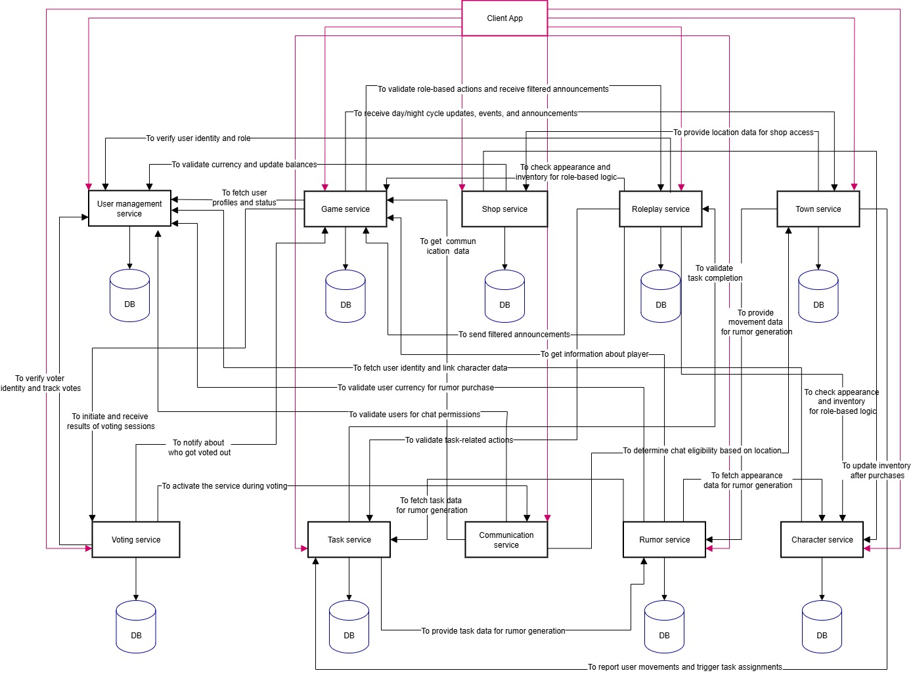

# Mafia Platform Design Document

---

This document outlines the microservice architecture, technologies, API and communication patterns for the multiplayer game, "Mafia".

## Game Flow Overview

---

It's a social deduction game where players secretly work to find all mafias while earning money by completing tasks to buy items for an advantage.

### Game Setup & Roles
The game begins in a lobby. Once at least 5 players have joined, the game service assigns a random career and a hidden role to each player.

Career: A player's career (e.g., Teacher, Hunter, Banker) determines the daily tasks they can complete to earn money.

Role: A player's role (e.g., Mafia, Doctor, Investigator) dictates their secret actions during the night and determines their specific win condition.

### The Day Phase
During the day, all players are active simultaneously. They can move to different locations in the city to complete career-specific tasks and earn money. Money can be spent in the shop on various items/assets, which may aid in their investigation or provide other benefits.

### The Night Phase
When the day ends, the night begins, and each player acts according to their role:

- Mafia: Secretly chooses a player to eliminate.
- Doctor: Secretly chooses a player to save from a potential attack.
- Investigator: Secretly chooses a player to reveal their role.

These and other role-based actions occur simultaneously.

### Voting and Exile
After the night, a new day begins, and the results of the night's actions are announced in the chat (e.g., "X was murdered"). Players use the chat to discuss who they suspect of being the Mafia. Following the discussion, a vote is cast, and the player with the most votes is exiled from the game. If there is a tie, no one is exiled.

### Victory Conditions
The game continues with a cycle of day and night phases until one of two conditions is met:

- Non-Mafia Victory: The non-Mafia players win if all Mafia members are successfully identified and exiled.
- Mafia Victory: The Mafia wins if the number of Mafia members is equal to or greater than the number of non-Mafia members remaining in the game.

# Service Boundaries & Architecture

---

## Service Responsibilities

- User Management Service: Handles user registration, authentication, profile data (email, username), and manages in-game currency balances. It also tracks device and location information for account security.
- Game Service: Acts as the central game orchestrator. It manages game lobbies, player states (role, status, career), controls the day/night cycle, and broadcasts major game events (e.g., deaths, announcements) to the relevant services.
- Shop Service: Manages the in-game item shop. It allows players to purchase items using their currency and includes an algorithm to balance item availability daily.
- Roleplay Service: Governs the logic for role-specific abilities. It validates and executes player actions (e.g., a Mafia member performing a kill), records these actions, and generates filtered announcements (e.g., "A player was attacked last night") for the Game Service to broadcast.
- Town Service: Manages the game world's locations. It tracks every player's movement between locations and reports these movements for other services to use.
- Character Service: Manages player avatars and inventory. It handles character customization (assets, slots) and keeps track of items purchased from the Shop.
- Rumors Service: Provides an information marketplace. Players can spend currency to buy pieces of information (rumors) about other players, sourced from their actions, appearance, or location.
- Communication Service: Facilitates all in-game chat. It provides a global chat during the voting phase and private, secure chat channels for specific groups (e.g., Mafia members, players in the same location).
- Task Service: Assigns daily tasks to players based on their role and career. It validates task completion and triggers currency rewards. The actions taken during tasks can become fodder for the Rumors Service.
- Voting Service: Manages the daily voting process to exile a player. It collects votes from all players, tallies the results, and reports the outcome to the Game Service.

## Architectural Diagram



The diagram illustrates the client-server architecture of the Mafia Platform. The client app communicates with a suite of modular microservices, each responsible for a distinct domain such as user management, gameplay orchestration, roleplay logic, voting, tasks, rumors, and more. Every service operates independently with its own database, enabling scalability and maintainability.

Arrows between services represent internal API calls used to validate actions, synchronize game state, and exchange filtered data—such as announcements, shop updates, character details, and team information. This design supports a robust, event-driven multiplayer experience with clear separation of concerns.


# Technologies & Communication Patterns

---

## Technology Stack
| Service(s)              | Developer     | Language | Framework      | Database              |
|--------------------------|--------------|----------|----------------|-----------------------|
| User Management, Game    | Alexandrina G. | Python   | FastAPI        | PostgreSQL            |
| Shop, Roleplay           | Alexander C.   | C#       | ASP.NET Core   | PostgreSQL            |
| Town, Character          | Dmitrii C.     | Kotlin   | Spring Boot    | PostgreSQL, Redis     |
| Rumors, Communication    | Dmitrii B.     | C#       | ASP.NET Core    | PostgreSQL, Websockets |
| Task, Voting             | Irina N.       | Python   | FastAPI         | PostgreSQL            |


## Communication Patterns

- Synchronous (REST APIs)

  Description: For direct, request/response interactions where the client needs an immediate answer. For example, when a user attempts to log in, they must wait for a success or failure response.
  Technology: We use RESTful APIs over HTTPS with JSON as the data serialization format.

  ### Motivation & Trade-offs:
- ✅ Simplicity: REST is a well-understood, stateless, and straightforward pattern, making development and debugging easier.
- ✅ Immediate Feedback: It's perfect for user-facing actions that require instant confirmation.
- ❌ Tight Coupling: The caller is temporarily coupled to the called service. If the downstream service is slow or unavailable, the caller is blocked.

# Communication Contract

This section defines our data management strategy and the specific API endpoints for each service.

## Data Management

- Database per Service: Each microservice (except communication service) owns and manages its own private database. No other service is allowed to access this database directly.
- API-based Access: All communication and data sharing between services must occur through the publicly exposed and well-defined APIs or through the asynchronous messaging system.

# API Endpoints

---

All request and response bodies are in **JSON** format.


## 1. User Management Service


#### POST /login
Authenticates user and returns JWT token.

**Request Body:**
```json
{
  "username": "string",
  "password": "string"
}
```

**Success Response (200):**
```json
{
  "data": {
    "token": "eyJhbGciOiJIUzI1NiIsInR5cCI6IkpXVCJ9...",
    "username": "string"
  }
}
```

**Error Responses:**
**401 Unauthorized**
  ```json
  {
    "error": {
      "code": "INVALID_CREDENTIALS",
      "message": "Invalid username or password"
    }
  }
  ```

#### POST /register
Creates a new user account.

**Request Body:**
```json
{
  "username": "string",
  "email": "string",
  "password": "string"
}
```

**Success Response (201):**
```json
{
  "data": {
    "id": "uuid"
  }
}
```

**Error Responses:**
- **409 Conflict**
  ```json
  {
    "error": {
      "code": "USER_ALREADY_EXISTS",
      "message": "Username or email already exists"
    }
  }
  ```
- **400 Bad Request**
  ```json
  {
    "error": {
      "code": "VALIDATION_ERROR",
      "message": "Password must be at least 8 characters long"
    }
  }
  ```

#### GET /profile
Retrieves user profile information.

**Headers:**
- `Authorization: Bearer <token>`

**Success Response (200):**
```json
{
  "data": {
    "id": "uuid",
    "username": "string",
    "email": "string",
    "currency": {
      "diamonds": 50,
      "coins": 250
    }
  }
}
```

**Error Responses:**
- **401 Unauthorized**
  ```json
  {
    "error": {
      "code": "INVALID_TOKEN",
      "message": "Invalid or expired token"
    }
  }
  ```

#### GET /currency
Retrieves user's current currency balance.

**Headers:**
- `Authorization: Bearer <token>`

**Success Response (200):**
```json
{
  "data": {
    "diamonds": 50,
    "coins": 250
  }
}
```

**Error Responses:**
- **401 Unauthorized**
  ```json
  {
    "error": {
      "code": "INVALID_TOKEN",
      "message": "Invalid or expired token"
    }
  }
  ```

---

## 2. Game Service


#### POST /lobby
Creates a new game lobby.

**Headers:**
- `Authorization: Bearer <token>`

**Request Body:**
```json
{
  "maxPlayers": 10
}
```

**Success Response (201):**
```json
{
  "data": {
    "lobbyId": "uuid",
    "hostId": "uuid",
    "maxPlayers": 10,
    "currentPlayers": 1,
    "status": "waiting"
  }
}
```

**Error Responses:**
- **400 Bad Request**
  ```json
  {
    "error": {
      "code": "INVALID_PLAYER_COUNT",
      "message": "Max players must be between 5 and 30"
    }
  }
  ```

#### POST /lobby/{lobbyId}/join
Join an existing game lobby.

**Headers:**
- `Authorization: Bearer <token>`

**Success Response (200):**
```json
{
  "data": {
    "lobbyId": "uuid",
    "playerId": "uuid",
    "currentPlayers": 6,
    "maxPlayers": 10
  }
}
```

**Error Responses:**
- **404 Not Found**
  ```json
  {
    "error": {
      "code": "LOBBY_NOT_FOUND",
      "message": "Lobby does not exist"
    }
  }
  ```
- **409 Conflict**
  ```json
  {
    "error": {
      "code": "LOBBY_FULL",
      "message": "Lobby has reached maximum capacity"
    }
  }
  ```

#### POST /lobby/{lobbyId}/start
Start the game in the lobby.

**Headers:**
- `Authorization: Bearer <token>`

**Success Response (200):**
```json
{
  "data": {
    "gameId": "uuid",
    "status": "started"
  }
}
```

**Error Responses:**
- **403 Forbidden**
  ```json
  {
    "error": {
      "code": "NOT_HOST",
      "message": "Only the host can start the game"
    }
  }
  ```
- **400 Bad Request**
  ```json
  {
    "error": {
      "code": "INSUFFICIENT_PLAYERS",
      "message": "At least 5 players required to start the game"
    }
  }
  ```

#### GET /game/{gameId}/state
Get current game state.

**Headers:**
- `Authorization: Bearer <token>`

**Success Response (200):**
```json
{
  "data": {
    "gameId": "uuid",
    "phase": "day",
    "dayNumber": 2,
    "playersAlive": 7,
    "totalPlayers": 10
  }
}
```

**Error Responses:**
- **404 Not Found**
  ```json
  {
    "error": {
      "code": "GAME_NOT_FOUND",
      "message": "Game does not exist"
    }
  }
  ```

#### GET /game/{gameId}/players/status
Get status of each player (alive/not alive).

**Headers:**
- `Authorization: Bearer <token>`

**Success Response (200):**
```json
{
  "data": {
    "players": [
      {
        "playerId": "uuid",
        "username": "player1",
        "status": "alive"
      },
      {
        "playerId": "uuid",
        "username": "player2",
        "status": "eliminated"
      }
    ]
  }
}
```

#### POST /game/{gameId}/career-assignment
Assign careers to players.

**Headers:**
- `Authorization: Bearer <token>`

**Success Response (200):**
```json
{
  "data": {
    "playerId": "uuid",
    "career": "teacher",
    "tasks": ["grade_papers", "teach_class"]
  }
}
```

#### GET /game/{gameId}/events
Get game events.

**Headers:**
- `Authorization: Bearer <token>`

**Success Response (200):**
```json
{
  "data": {
    "events": [
      {
        "id": "uuid",
        "type": "elimination",
        "message": "Player X was eliminated",
        "timestamp": "2023-10-01T12:00:00Z"
      }
    ]
  }
}
```

#### GET /game/{gameId}/players-roles
Get players and their roles.

**Headers:**
- `Authorization: Bearer <token>`

**Success Response (200):**
```json
{
  "data": {
    "players": [
      {
        "playerId": "uuid",
        "username": "player1",
        "role": "unknown"
      }
    ]
  }
}
```

#### POST /game/{gameId}/voting
Submit voting results.

**Headers:**
- `Authorization: Bearer <token>`

**Request Body:**
```json
{
  "targetPlayerId": "uuid"
}
```

**Success Response (200):**
```json
{
  "data": {
    "voteSubmitted": true,
    "targetPlayerId": "uuid"
  }
}
```

**Error Responses:**
- **400 Bad Request**
  ```json
  {
    "error": {
      "code": "VOTING_NOT_ACTIVE",
      "message": "Voting phase is not currently active"
    }
  }
  ```
- **404 Not Found**
  ```json
  {
    "error": {
      "code": "PLAYER_NOT_FOUND",
      "message": "Target player does not exist"
    }
  }
  ```
- **409 Conflict**
  ```json
  {
    "error": {
      "code": "ALREADY_VOTED",
      "message": "You have already cast your vote"
    }
  }
  ```

---

## 3. Shop Service


#### POST /purchase
Purchase an item from the shop.

**Headers:**
- `Authorization: Bearer <token>`

**Request Body:**
```json
{
  "itemId": "uuid",
  "quantity": 1
}
```

**Success Response (200):**
```json
{
  "data": {
    "itemId": "uuid",
    "itemName": "Garlic",
    "quantity": 1,
    "totalCost": 150,
    "remainingCurrency": {
      "coins": 100,
      "diamonds": 50
    }
  }
}
```

**Error Responses:**
- **400 Bad Request**
  ```json
  {
    "error": {
      "code": "INSUFFICIENT_FUNDS",
      "message": "Not enough money to purchase this item"
    }
  }
  ```
- **404 Not Found**
  ```json
  {
    "error": {
      "code": "ITEM_NOT_FOUND",
      "message": "Item does not exist"
    }
  }
  ```
- **409 Conflict**
  ```json
  {
    "error": {
      "code": "ITEM_OUT_OF_STOCK",
      "message": "Item is currently out of stock"
    }
  }
  ```

#### POST /phase-update
Receive day/night update and automatically restock.

**Headers:**
- `Authorization: Bearer <token>`

**Request Body:**
```json
{
  "gameId": "uuid",
  "phase": "night",
  "dayNumber": 2
}
```

**Success Response (200):**
```json
{
  "data": {
    "restocked": true,
    "newItems": 5,
    "phase": "night"
  }
}
```

#### GET /items
List available items in the shop.

**Headers:**
- `Authorization: Bearer <token>`

**Success Response (200):**
```json
{
  "data": {
    "items": [
      {
        "id": "uuid",
        "name": "Night Vision Goggles",
        "description": "See better during night phase",
        "price": {
          "coins": 150,
          "diamonds": 0
        },
        "stock": 5
      }
    ]
  }
}
```

---

## 4. Roleplay Service


#### POST /phase-update
Update day/night phase.

**Headers:**
- `Authorization: Bearer <token>`

**Request Body:**
```json
{
  "gameId": "uuid",
  "newPhase": "night",
  "dayNumber": 2
}
```

**Success Response (200):**
```json
{
  "data": {
    "gameId": "uuid",
    "phase": "night",
    "dayNumber": 2
  }
}
```

**Error Responses:**
- **400 Bad Request**
  ```json
  {
    "error": {
      "code": "INVALID_PHASE_TRANSITION",
      "message": "Cannot transition from current phase to requested phase"
    }
  }
  ```

#### POST /night-events
Register night events - which contains who did what and to whom.

**Headers:**
- `Authorization: Bearer <token>`

**Request Body:**
```json
{
  "gameId": "uuid",
  "playerId": "uuid",
  "action": "eliminate",
  "targetPlayerId": "uuid"
}
```

**Success Response (201):**
```json
{
  "data": {
    "eventId": "uuid",
    "action": "eliminate"
  }
}
```

**Error Responses:**
- **400 Bad Request**
  ```json
  {
    "error": {
      "code": "INVALID_ACTION",
      "message": "This action is not valid for your role"
    }
  }
  ```
- **409 Conflict**
  ```json
  {
    "error": {
      "code": "ACTION_ALREADY_SUBMITTED",
      "message": "You have already submitted an action for this night"
    }
  }
  ```

---

## 5. Town Service


#### GET /locations
Retrieve all available locations.

**Headers:**
- `Authorization: Bearer <token>`

**Success Response (200):**
```json
{
  "data": {
    "locations": [
      {
        "id": "uuid",
        "name": "School",
        "description": "Education center"
      }
    ]
  }
}
```

#### GET /locations/{locationId}
Get details of a specific location.

**Headers:**
- `Authorization: Bearer <token>`

**Success Response (200):**
```json
{
  "data": {
    "id": "uuid",
    "name": "School",
    "description": "Education center"
  }
}
```

**Error Responses:**
- **404 Not Found**
  ```json
  {
    "error": {
      "code": "LOCATION_NOT_FOUND",
      "message": "Location does not exist"
    }
  }
  ```

#### GET /movements
Get movement of all players.

**Headers:**
- `Authorization: Bearer <token>`

**Success Response (200):**
```json
{
  "data": {
    "movements": [
      {
        "playerId": "uuid",
        "locationId": "uuid",
        "timestamp": "2023-10-01T12:00:00Z"
      }
    ]
  }
}
```

#### POST /move
Movement depending on location and day.

**Headers:**
- `Authorization: Bearer <token>`

**Request Body:**
```json
{
  "playerId": "uuid",
  "locationId": "uuid"
}
```

**Success Response (200):**
```json
{
  "data": {
    "playerId": "uuid",
    "fromLocationId": "uuid",
    "toLocationId": "uuid",
    "timestamp": "2023-10-01T12:00:00Z"
  }
}
```

**Error Responses:**
- **404 Not Found**
  ```json
  {
    "error": {
      "code": "LOCATION_NOT_FOUND",
      "message": "Location does not exist"
    }
  }
  ```

#### GET /movements/{playerId}
Get all movements of a specific player.

**Headers:**
- `Authorization: Bearer <token>`

**Success Response (200):**
```json
{
  "data": {
    "playerId": "uuid",
    "movements": [
      {
        "locationId": "uuid",
        "locationName": "School",
        "timestamp": "2023-10-01T12:00:00Z"
      }
    ]
  }
}
```

**Error Responses:**
- **404 Not Found**
  ```json
  {
    "error": {
      "code": "PLAYER_NOT_FOUND",
      "message": "Player does not exist"
    }
  }
  ```

---

## 6. Character Service


#### GET /{playerId}/items
Get list of items for a player.

**Headers:**
- `Authorization: Bearer <token>`

**Success Response (200):**
```json
{
  "data": {
    "items": [
      {
        "id": "uuid",
        "name": "Night Vision Goggles",
        "quantity": 1
      }
    ]
  }
}
```

**Error Responses:**
- **404 Not Found**
  ```json
  {
    "error": {
      "code": "PLAYER_NOT_FOUND",
      "message": "Player does not exist"
    }
  }
  ```

#### POST /{playerId}/items
Add item to player's inventory.

**Headers:**
- `Authorization: Bearer <token>`

**Request Body:**
```json
{
  "itemId": "uuid",
  "quantity": 1
}
```

**Error Response

**Success Response (201):**
```json
{
  "data": {
    "itemId": "uuid",
    "quantity": 1,
    "totalQuantity": 2
  }
}
```

**Error Responses:**
- **404 Not Found**
  ```json
  {
    "error": {
      "code": "ITEM_NOT_FOUND",
      "message": "Item does not exist"
    }
  }
  ```

#### DELETE /{playerId}/items/{itemId}
Drop/delete item from inventory.

**Headers:**
- `Authorization: Bearer <token>`

**Success Response (200):**
```json
{
  "data": {
    "itemId": "uuid",
    "removed": true
  }
}
```

**Error Responses:**
- **404 Not Found**
  ```json
  {
    "error": {
      "code": "ITEM_NOT_FOUND",
      "message": "Item not found in inventory"
    }
  }
  ```
- **404 Not Found**
  ```json
  {
    "error": {
      "code": "PLAYER_NOT_FOUND",
      "message": "Player does not exist"
    }
  }
  ```

#### POST /{playerId}/items/{itemId}/use
Use an item.

**Headers:**
- `Authorization: Bearer <token>`

**Success Response (200):**
```json
{
  "data": {
    "itemId": "uuid"
  }
}
```

**Error Responses:**
- **404 Not Found**
  ```json
  {
    "error": {
      "code": "ITEM_NOT_FOUND",
      "message": "Item not found in inventory"
    }
  }
  ```

- **404 Not Found**
  ```json
  {
    "error": {
      "code": "PLAYER_NOT_FOUND",
      "message": "Player does not exist"
    }
  }
  ```

#### POST /{playerId}/assets
Add character asset.

**Headers:**
- `Authorization: Bearer <token>`

**Request Body:**
```json
{
  "slot": "hair",
  "assetId": "uuid"
}
```

**Success Response (201):**
```json
{
  "data": {
    "slot": "hair",
    "assetId": "uuid",
    "equipped": true
  }
}
```

**Error Responses:**
- **400 Bad Request**
  ```json
  {
    "error": {
      "code": "INVALID_SLOT",
      "message": "Invalid asset slot specified"
    }
  }
  ```

#### GET /{playerId}/appearance
Get character appearance - list of all assets.

**Headers:**
- `Authorization: Bearer <token>`

**Success Response (200):**
```json
{
  "data": {
    "assets": {
      "hair": "uuid",
      "shirt": "uuid",
      "pants": "uuid",
      "accessories": ["uuid", "uuid"]
    }
  }
}
```

**Error Responses:**
- **404 Not Found**
  ```json
  {
    "error": {
      "code": "PLAYER_NOT_FOUND",
      "message": "Player does not exist"
    }
  }
  ```

#### PUT /{playerId}/assets
Update character asset.

**Headers:**
- `Authorization: Bearer <token>`

**Request Body:**
```json
{
  "slot": "shirt",
  "assetId": "uuid"
}
```

**Success Response (200):**
```json
{
  "data": {
    "slot": "shirt",
    "previousAssetId": "uuid",
    "newAssetId": "uuid"
  }
}
```

---

## 7. Rumours Service


#### POST /purchase
Get rumour - player buys a rumour.

**Headers:**
- `Authorization: Bearer <token>`

**Request Body:**
```json
{
  "rumourType": "player_role",
  "targetPlayerId": "uuid"
}
```

**Success Response (200):**
```json
{
  "data": {
    "rumour": "Player X was seen near the victim's house last night"
  }
}
```

**Error Responses:**
- **400 Bad Request**
  ```json
  {
    "error": {
      "code": "INSUFFICIENT_FUNDS",
      "message": "Not enough currency to purchase rumour"
    }
  }
  ```
- **404 Not Found**
  ```json
  {
    "error": {
      "code": "NO_RUMOURS_AVAILABLE",
      "message": "No rumours available for this target"
    }
  }
  ```

---

## 8. Communication Service


## API Reference

---

### Send Global Message

**Endpoint:** `POST /api/chat/global/{lobbyId}/send-message`

**Description:** Sends a message to the specified global chat in the specified lobby.

**URL Parameters:**

* `lobbyId` *(string)* – Unique lobby identifier.

**Request Body:** [ChatMessage Model](#chatmessage-model)

---

### Send Private Message

**Endpoint:** `POST /api/chat/private/{lobbyId}/{channelName}/send-message`

**Description:** Sends a message to all clients in the specified private channel inside the specified lobby.

**URL Parameters:**

* `lobbyId` *(string)* – The lobby identifier.
* `channelName` *(string)* – The private channel name.

**Request Body:** [ChatMessage Model](#chatmessage-model)

---

## SignalR Hub Reference

### Server Methods (Client → Server)

| Method                                                                        | Description                                                                            |
| ----------------------------------------------------------------------------- | -------------------------------------------------------------------------------------- |
| `JoinGlobalChat(string lobbyId, long userId)`                                             | Adds the specified user to the global chat in the specified lobby.                                                     |
| `LeaveGlobalChat(string lobbyId, long userId)`                                            | Removes the specified user from the global chat in the specified lobby.                                                |
| `JoinPrivateChannel(string lobbyId, string channelName, long userId)`                      | Adds the specified user to the specified private channel.                                                  |
| `LeavePrivateChannel(string lobbyId, string channelName, long userId)`                     | Removes the speicified user from the specified private channel.                                             |
| `SendGlobalMessage(string lobbyId, ChatMessage message)`                      | Broadcasts a message to the global chat in the specified lobby. Throws `HubException` on validation errors.    |
| `SendPrivateMessage(string channelName, string lobbyId, ChatMessage message)` | Broadcasts a message to the specified private channel in the specified lobby. Throws `HubException` on validation errors. |

---

### Client Methods (Server → Client)

| Method                                         | Description                                                |
| ---------------------------------------------- | ---------------------------------------------------------- |
| `ReceiveGlobalMessage(ChatResponse response)`  | Triggered when a new message arrives in a global chat.    |
| `ReceivePrivateMessage(ChatResponse response)` | Triggered when a new message arrives in a private channel. |

---

## Data Models

### ChatMessage Model

| Field       | Type   | Description                          | Validation Rules |
|-------------|--------|--------------------------------------|------------------|
| `senderId`  | long   | The unique ID of the sender         | Required, must be ≥ 0 |
| `senderName`| string | The display name of the sender      | Required, 2–50 characters |
| `content`   | string | The text content of the message     | Required, not empty, max 200 characters |

**Example:**

```json
{
  "senderId": 123,
  "senderName": "TestUser",
  "content": "Hello, world!"
}
```

---

### ChatResponse Model

| Field       | Type     | Description |
|-------------|----------|-------------|
| `senderId`  | long     | ID of the sender |
| `senderName`| string   | Name of the sender |
| `content`   | string   | Message content |
| `timestamp` | DateTime | UTC timestamp from server |

**Example:**
```json
{
  "senderId": 123,
  "senderName": "TestUser",
  "content": "Hello, world!",
  "timestamp": "2025-09-09T20:30:00.123Z"
}
```

---

## 9. Task Service


#### GET /player/{playerId}
Get tasks based on player.

**Headers:**
- `Authorization: Bearer <token>`

**Success Response (200):**
```json
{
  "data": {
    "tasks": [
      {
        "id": "uuid",
        "name": "Teach Class",
        "description": "Teach a class at the school",
        "reward": {
          "coins": 50,
          "diamonds": 0
        },
        "status": "available",
        "location": "school"
      }
    ]
  }
}
```

#### PUT /tasks/{taskId}/status
Update task status.

**Headers:**
- `Authorization: Bearer <token>`

**Request Body:**
```json
{
  "status": "completed"
}
```

**Success Response (200):**
```json
{
  "data": {
    "taskId": "uuid",
    "status": "completed",
    "reward": {
      "coins": 50,
      "diamonds": 0
    },
    "completedAt": "2023-10-01T12:00:00Z"
  }
}
```

**Error Responses:**
- **404 Not Found**
  ```json
  {
    "error": {
      "code": "TASK_NOT_FOUND",
      "message": "Task does not exist"
    }
  }
  ```

---

## 10. Voting Service


#### POST /vote
Assign vote to a player.

**Headers:**
- `Authorization: Bearer <token>`

**Request Body:**
```json
{
  "gameId": "uuid",
  "voterId": "uuid",
  "targetPlayerId": "uuid"
}
```

**Success Response (201):**
```json
{
  "data": {
    "voteId": "uuid",
    "voterId": "uuid",
    "targetPlayerId": "uuid",
    "timestamp": "2023-10-01T12:00:00Z"
  }
}
```

**Error Responses:**
- **400 Bad Request**
  ```json
  {
    "error": {
      "code": "VOTING_NOT_ACTIVE",
      "message": "Voting phase is not currently active"
    }
  }
  ```
- **409 Conflict**
  ```json
  {
    "error": {
      "code": "ALREADY_VOTED",
      "message": "You have already cast your vote for this round"
    }
  }
  ```

#### GET /votes/{gameId}
Get list of votes for a game.

**Headers:**
- `Authorization: Bearer <token>`

**Success Response (200):**
```json
{
  "data": {
    "votingSessions": [
      {
        "sessionId": "uuid_of_session_1",
        "dayNumber": 1,
        "votes": [
          {
            "targetPlayerId": "uuid_player_A",
            "voteCount": 3
          },
          {
            "targetPlayerId": "uuid_player_B",
            "voteCount": 2
          }
        ],
        "totalVotes": 5
      }
    ]
  }
}
```

**Error Responses:**
- **404 Not Found**
  ```json
  {
    "error": {
      "code": "GAME_NOT_FOUND",
      "message": "Game does not exist"
    }
  }
  ```

---

## Common Error Codes

All services may return these common error responses:

### 500 Internal Server Error
```json
{
  "error": {
    "code": "INTERNAL_SERVER_ERROR",
    "message": "An unexpected error occurred"
  }
}
```

### 503 Service Unavailable
```json
{
  "error": {
    "code": "SERVICE_UNAVAILABLE",
    "message": "Service is temporarily unavailable"
  }
}
```

### 400 Bad Request - Validation Error
```json
{
  "error": {
    "code": "VALIDATION_ERROR",
    "message": "Invalid input data",
    "details": {
      "field": "username",
      "issue": "Username is required"
    }
  }
}
```

---

## Authentication

All API endpoints (except login and register) require JWT authentication via the `Authorization` header:

```
Authorization: Bearer <your-jwt-token>
```

Tokens expire after 24 hours and must be refreshed by re-authenticating.

---

# Repository Structure & Development Workflow

## Repository Organization

- Common Public Repository (CPR): Contains documentation, architecture diagrams, and submodule references
- Individual Private Repositories: Each team member owns 2 microservice repositories
  - Alexandrina G.: user-management-service, game-service
  - Alexander C.: shop-service, roleplay-service
  - Dmitrii C.: town-service, character-service
  - Dmitrii B.: rumors-service, communication-service
  - Irina N.: task-service, voting-service


### Branch Strategy
- main: Production-ready code, protected branch
- development: Integration branch for testing
- feature/*: Individual feature development


### Contribution Rules
- Minimum 2 code reviews required for merge
- All tests must pass before merge
- Follow naming conventions: feature/service-functionality
- Squash commits when merging to main
- Delete feature branches after successful merge

### Code Review Process
1. Create feature branch from development
2. Implement changes with appropriate tests
3. Create PR to development branch
4. Address review feedback
5. Squash and merge after approval

### Testing Requirements
- Unit test coverage minimum: 75 %
